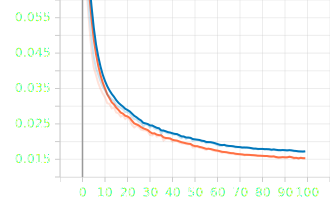
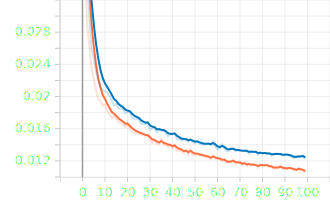
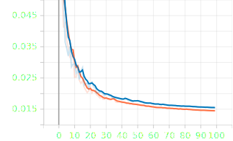
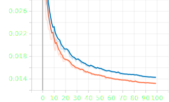
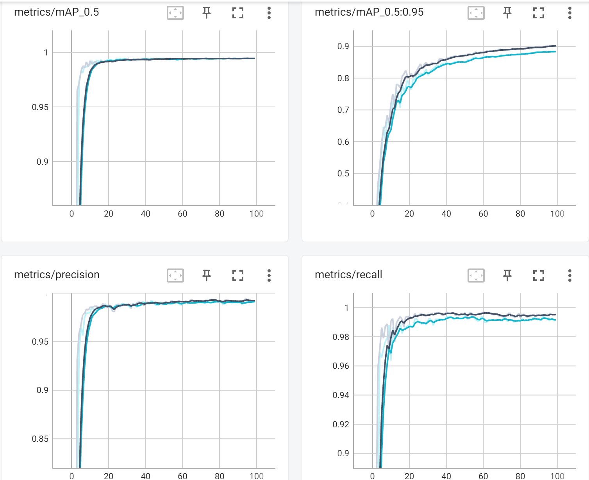

# **Nordic Vehicle Dataset**
You can find the NVD dataset here:
https://nvd.ltu-ai.dev/

This repository contains code for fine-tuning YOLOv5 and YOLOv8 on the NVD dataset. Below, you can find setup instructions.

Note: The code for fine-tuning Faster R-CNN will be added soon.
## **Setup**
Verify that Python is installed and the version is between 3.8 (inclusive) and 3.11 (exclusive).

On Windows:

    python --version

On Ubuntu:

    python3 --version

This will display the version of Python installed on your system. If the version is less than 3.8 or equal to or greater than 3.11, you will need to install a compatible version.

Extract the source code zip file to a directory (```source directory```). Create another directory (```videos directory```) and copy the video files and the accompanying annotation ```.xml``` files into it. Ensure that each annotation file has the same name as its corresponding video file.

Navigate to the ```source directory``` by changing the current directory:

    cd Smart-Plane-master

Create and activate a virtual environment:

On Windows:

    python -m venv .venv
    .venv\Scripts\Activate.ps1

On Ubuntu:

    python3 -m venv .venv
    source .venv/bin/activate


Note: ```.venv``` is the name of the virtual environment, you can change it to any other name of your choice.
Now upgrade ```pip``` and install the required packages:
    
    python -m pip install --upgrade pip
    pip install -r requirements.txt

After you have set up the environment, before executing any of the following commands, make sure to activate the environment if it has not been activated already.

Windows:

    .venv\Scripts\Activate.ps1

Ubuntu:
    
    source .venv/bin/activate

## **Data Visualization and Preparation**

### **Visualize Annotations**
Before training/validation/test data is prepared, it's crucial to ensure that the annotated data is correct and aligned with the video frames properly. There is a ```view_annotations.py``` script that can be utilized to visualize an annotation file:

    python view_annotations.py [path/to/an/annotation/file]

It's worth mentioning that there should be a video file with the same name as the annotation file located in the same directory or a directory containing extracted frames with the same name as the annotation file, located alongside the annotation file.

After running the script, the frames with augmented annotated data will be displayed one after another by pressing a key. You can halt the display process by pressing the ```'q'``` key.

### **Prepare data**
To prepare the data, we need to extract frames from the videos and convert the annotations for each frame into the YOLO format. Also, we need to split the data into training, validation and test sets. This can be accomplished using the ```prepare_data.py``` script:

    python prepare_data.py [--source ANNOTATIONS_DIR or ANNOTATION_FILE] [--data_dir data]

This will create a ```data``` directory and store all of the extracted frames and label data inside it. 

As the ```source```, you can provide either of the following:

* A directory containing annotation files and their corresponding videos/frames with the same name alongside themselves.
* A single annotation file that has a video file or frames directory with the same name alongside itself.

### **Visualize Prepared Data**
You can visualize all of the prepared data or only the data created for a specific video using the ```view_data.py``` script as follows:

    python view_data.py [--type TYPE] [--video_file VIDEO_FILE_NAME]

The ```TYPE``` can be either ```train```, ```val```, or ```test```, indicating which split of the data you want to view. If the ```--video_file``` argument is provided, only the data related to that specific video file will be displayed. Due to the possibility of a large amount of data, it is recommended to check the data related to each video file individually by using the ```--video_file``` argument to ensure that the data has been correctly extracted from each video file. Similarly to the ```view_annotations.py``` script, this script also opens a window and displays the frames with augmented annotated data by pressing a key. To end the display process, press the ```'q'``` key.

## Set up Logging
Before starting the training process for the first time, you need to set up logging. To do this, you will need a ```ClearML``` account. To create an account or login to an existing one, navigate to [https://app.clear.ml/settings/workspace-configuration](https://app.clear.ml/settings/workspace-configuration), click on your profile picture, go to the ```Settings``` page, then click on ```Workspace```. Next, press ```Create new credentials``` and then press ```Copy to clipboard```. Finally, run the following command in the terminal with the activated environment:

    clearml-init
  
Then paste copied configuration when prompted and press ```Enter```. If everything is okay, you should see the following message:
    
    ClearML Hosts configuration:
    Web App: https://app.clear.ml
    API: https://api.clear.ml
    File Store: https://files.clear.ml

    Verifying credentials ...
    Credentials verified!

    New configuration stored in <path to the created clearml.conf>
    ClearML setup completed successfully.

## **Train**
To train the network using the prepared data, run:

    python train.py [--epochs EPOCHS] [--yolo_model YOLO_MODEL] [--batch BATCH-SIZE]

Replace ```EPOCHS``` with the number of training epochs and ```YOLO_MODEL``` with one of the following YOLO models:
    
    yolov5n, yolov5s, yolov5m, yolov5l, yolov5x, yolov8n, yolov8s, yolov8m, yolov8l, yolov8x  

```yolov*n``` has the lowest number of parameters and the fastest speed. 
```yolov*x``` has the maximum number of parameters and the lowest speed.

If you get out of memory error try to reduce ```BATCH-SIZE```.

Training is a long process and requires a huge amount of system resources. You can log in to you ClearML account to view the progress and results.

## **Test**
After the training is finished, you can validate the trained model with the test set (the test set is created automatically in the data preparation phase and is not used for training.):

    python val.py [--yolo_model YOLO_MODEL]

Here for ```YOLO_MODEL``` provide the path to a trained network's weight file (```.pt```) located in the ```runs/train``` directory. The validation results are save in ```runs/val``` directory.

## **Detect Cars**
To detect cars in videos and images you can simply pass a file (video/image) or a directory path containing videos/images to ```detect.py``` script:

    python detect.py [--yolo_model YOLO_MODEL] [--source FILE/DIR] [--conf_thres CONF_THRES]

As before ```YOLO_MODEL``` is the path to a trained network's weights file, ```FILE/DIR``` is a file path to an image or video or a directory path containing images and videos. ```CONF_THRES``` is the confidence threshold which is set to 0.25 by default. The detection results are saved in ```runs/detect``` directory.

## **Results**

### Train Box Loss per Epoch (YOLOv5s & YOLOv5n)


### Train Object Loss per Epoch (YOLOv5s & YOLOv5n)


### Validation Box Loss per Epoch (YOLOv5s & YOLOv5n)


### Validation Object Loss per Epoch (YOLOv5s & YOLOv5n)


### mAP, Precision and Recall per Epoch Curves


